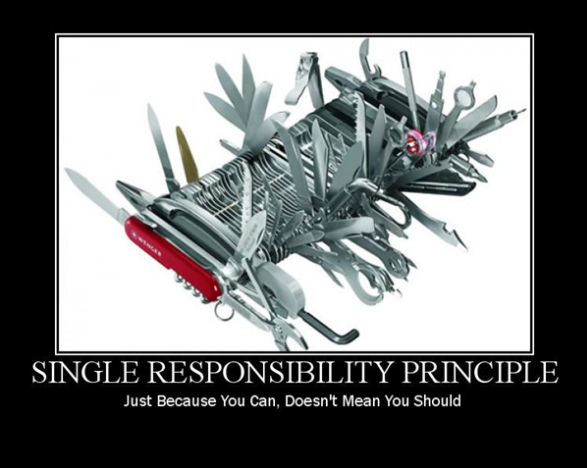
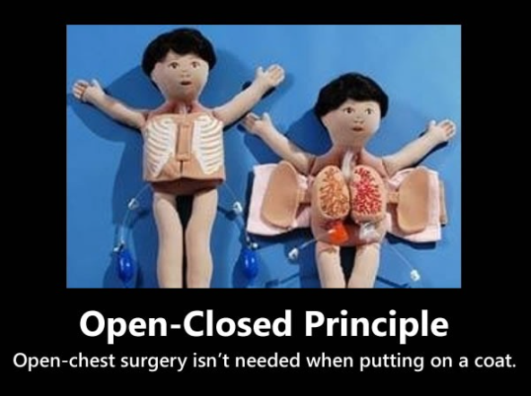
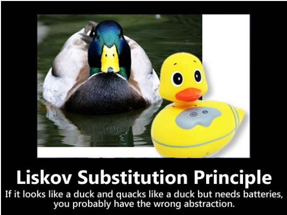
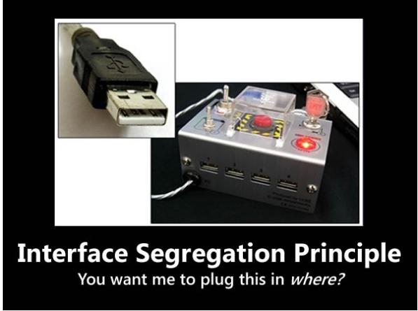
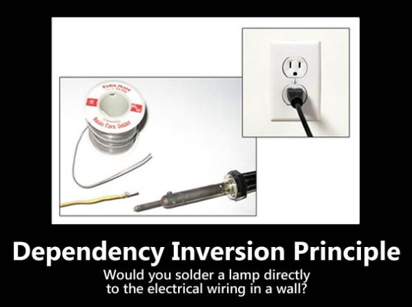

---
layout: post
title:  "Tìm hiểu về SOLID"
date:   2021-08-07 13:30:18 +0700
categories: jekyll update
---

# **Giới thiệu** 
**SOLID** được xây dựng dựa trên các tính chất đặc biệt này của OOP. Nếu như các bạn chưa nắm rõ hoặc chưa biết về OOP thì có thể tham khảo [tại đây](https://github.com/QuocDang0704/)

**Khái niệm** 
SOLID là viết tắt của 5 chữ cái đầu trong 5 nguyên tắc thiết kế hướng đối tượng, giúp cho developer viết ra những đoạn code dễ đọc, dễ hiểu, dễ maintain, được đưa ra bởi Bob Martin và Michael Feathers. Việc theo sát 5 nguyên tắc này nói thì để đáp ứng cả 5 nguyên tắc e là điều không đơn giản. 5 nguyên tắc đó bao gồm:

- **S**ingle responsibility priciple (SRP)
- **O**pen/Closed principle (OCP)
- **L**iskov substitution principe (LSP)
- **I**nterface segregation principle (ISP)
- **D**ependency inversion principle (DIP) Trong bài viết này mình sẽ giới thiệu từng nguyên tắc trong 5 nguyên tắc trên cũng như cách áp dụng nó làm tăng chất lượng code trong Ruby

# **1. Single responsibility priciple**

Chữ **S** trong **SOLID**, có ý nghĩa:
```php
    Một class chỉ nên giữ 1 trách nhiệm duy nhất*
    (Chỉ có thể sửa đổi class với 1 lý do duy nhất)
```

Một class có quá nhiều chức năng sẽ trở nên cồng kềnh và trở nên khó đọc, khó maintain. Mà đối với ngành IT việc requirement thay đổi, cần thêm sửa chức năng là rất bình thường, nên việc code trong sáng, dễ đọc dễ hiểu là rất cần thiết. 
Để hiểu rõ hơn, ta cũng soi vào đoạn code vi phạm nguyên tắc này:


    public class ReportManager(){
        public void ReadDataFromDB();
        public void ProcessData();
        public void PrintReport();
    }

Như các bạn đã thấy class này giữ tới 3 trách nhiệm: Đọc dữ liệu từ DB, xử lý dữ liệu, in kết quả. Do đó, chỉ cần ta thay đổi DB, thay đổi cách xuất kết quả, … ta sẽ phải sửa đổi class này. Càng về sau class sẽ càng phình to ra. Theo đúng nguyên lý, ta phải tách class này ra làm 3 class riêng. Tuy số lượng class nhiều hơn nhưng việc sửa chữa sẽ đơn giản hơn, class ngắn hơn nên cũng ít bug hơn.

# **2. Open/closed principle**

Chữ **O** trong **SOLID**, có ý nghĩa:
```php
Có thể thoải mái mở rộng 1 class, nhưng không được sửa đổi bên trong class đó 
(open for extension but closed for modification).
```

Theo nguyên lý này, mỗi khi ta muốn thêm chức năng,.. cho chương trình, chúng ta nên viết class mới mở rộng class cũ ( bằng cách kế thừa hoặc sở hữu class cũ) không nên sửa đổi class cũ.

Ví dụ khi ta muốn xây dựng cơ chế tính tiền lương ta thường viết

    class Owner {
        private int salary;
        private int port;

        int salary() {
            if (port == 3) {
                return salary;
            } else if (port == 4) {
                return salary * 2;
            } else if (port == 4) {
                return salary * 3;
            }else return 0;
        }
    }


Theo cách làm trên hoàn toàn đúng. Tuy nhiên, nếu bạn thiết kế chương trình như thế này thì thực sự có nhiều điểm không hợp lí lắm, nếu chúng ta lại có thêm 1 kiểu nhuận bút nữa thì sao, khi đó chúng ta lại phải vào sửa lại hàm để đáp ứng dược nhu cầu mới hay sao? Code mới lúc đó sẽ ảnh hưởng tới code cũ, như vậy có khả năng là sẽ làm hỏng luôn code cũ, …

Rõ ràng là chúng ta nên có một phương pháp an toàn và thân thiện hơn như. 

    class Owner {
        private int salary;
        private int port;

        int salary() {
            return salary();
        }
        class Cashier extends Owner{
            @Override
            int salary() {
                return super.salary * 2; 
            }
        }
    }

Có thể thấy rằng, cách thiết kế này làm cho lớp Owner trở nên: ĐÓNG với mọi sự thay đổi bên trong, nhưng luôn MỞ cho sự kế thừa để mở rộng sau này. Trong tương lai, khi nhu cầu mở rộng chương trình xuất hiện, có thêm nhiều đối tượng nữa cần xử lí thì chúng ta chỉ cần thêm lớp mới là sẽ giải quyết được vấn đề, trong khi vẫn đảm bảo được chương trình có sẵn không bị ảnh hưởng, nhờ đó mà hạn chế được phạm vi test, giúp giảm chi phí phát triển. Đó cũng là một trong những lợi ích ở khía cạnh dễ bảo trì sản phẩm.

# **3. Liskov Substitution Principle**

Chữ **L** trong **SOLID**, có ý nghĩa:
```php
Trong một chương trình, các object của class con có thể thay thế class cha mà không làm thay đổi tính đúng đắn của chương trình
```
Hơi khó hiểu? Không sao, lúc mới đọc mình cũng vậy. Hãy tưởng tượng bạn có 1 class cha tên Vịt. Các class VịtBầu, VịtXiêm có thể kế thừa class này, chương trình chạy bình thường. Tuy nhiên nếu ta viết class VịtChạyPin, cần pin mới chạy được. Khi class này kế thừa class Vịt, vì không có pin không chạy được, sẽ gây lỗi. Đó là 1 trường hợp vi phạm nguyên lý này.

# **4. Interface Segregation Principle**

Chữ **I** trong **SOLID**, có ý nghĩa:
```php
Thay vì dùng 1 interface lớn, ta nên tách thành nhiều interface nhỏ, với nhiều mục đích cụ thể
```

Nguyên lý này khá dễ hiểu. Hãy tưởng tượng chúng ta có 1 interface lớn, khoảng 100 methods. Việc implements sẽ khá cực khổ, ngoài ra còn có thể dư thừa vì 1 class không cần dùng hết 100 method. Khi tách interface ra thành nhiều interface nhỏ, gồm các method liên quan tới nhau, việc implement và quản lý sẽ dễ hơn.

# **5. Dependency inversion principle**

Chữ **D** trong **SOLID**, có ý nghĩa:
```php
1. Các module cấp cao không nên phụ thuộc vào các modules cấp thấp. 
   Cả 2 nên phụ thuộc vào abstraction.
2. Interface (abstraction) không nên phụ thuộc vào chi tiết, mà ngược lại.
( Các class giao tiếp với nhau thông qua interface, 
không phải thông qua implementation.)
```

Nguyên lý này khá lắt léo, mình sẽ lấy ví dụ thực tế. Chúng ta đều biết 2 loại đèn: đèn tròn và đèn huỳnh quang. Chúng cùng có đuôi tròn, do đó ta có thể thay thế đèn tròn bằng đèn huỳnh quanh cho nhau 1 cách dễ dàng.

Ở đây, interface chính là đuôi tròn, implementation là bóng đèn tròn và bóng đèn huỳnh quang. Ta có thể swap dễ dàng giữa 2 loại bóng vì ổ điện chỉ quan tâm tới interface (đuôi tròn), không quan tâm tới implementation.

Trong code cũng vậy, khi áp dụng Dependency Inverse, ta chỉ cần quan tâm tới interface. Để kết nối tới database, ta chỉ cần gọi hàm Get, Save … của Interface IDataAccess. Khi thay database, ta chỉ cần thay implementation của interface này.
# Tổng kết.
Trên đây mình đã trình bày 5 nguyên tắc trong OOP.Áp dụng những nguyên tắc này sẽ đưa chúng ta tới một cảnh giới mới của việc thiết kế phần mềm, khi tuân theo những nguyên tắc này chương trình của chúng ta bây giờ đã linh động, rành mạch hơn, dễ bảo trì hơn, dễ mở rộng hơn, có tính kế thừa cao, …. Tất nhiên vẫn còn một số nguyên tắc khác nhưng SOLID là 5 nguyên tắc quan trong nhất, bài viết đến đây khá dài rồi nếu có thể mình sẽ trình bày những nguyên tắc còn lại sau.